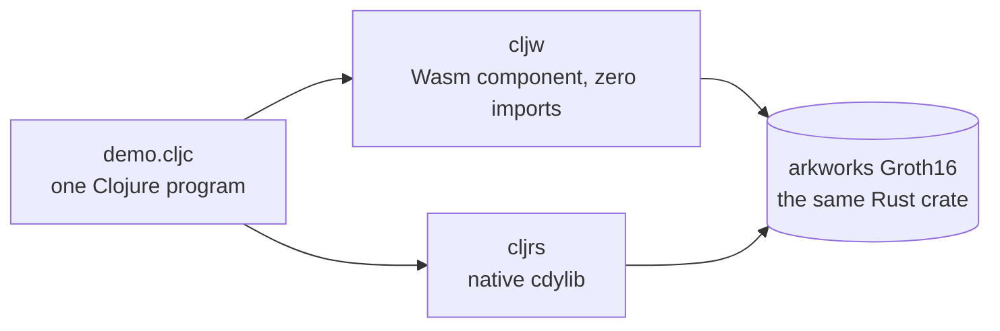
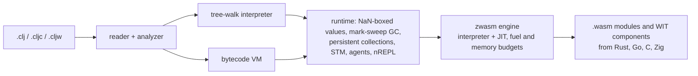
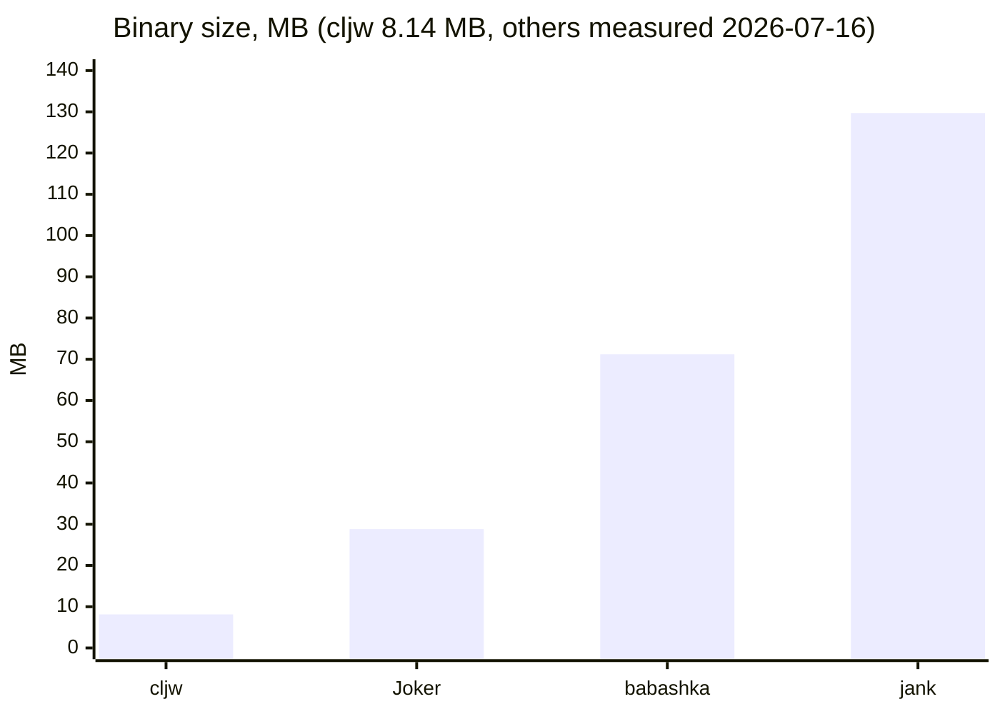
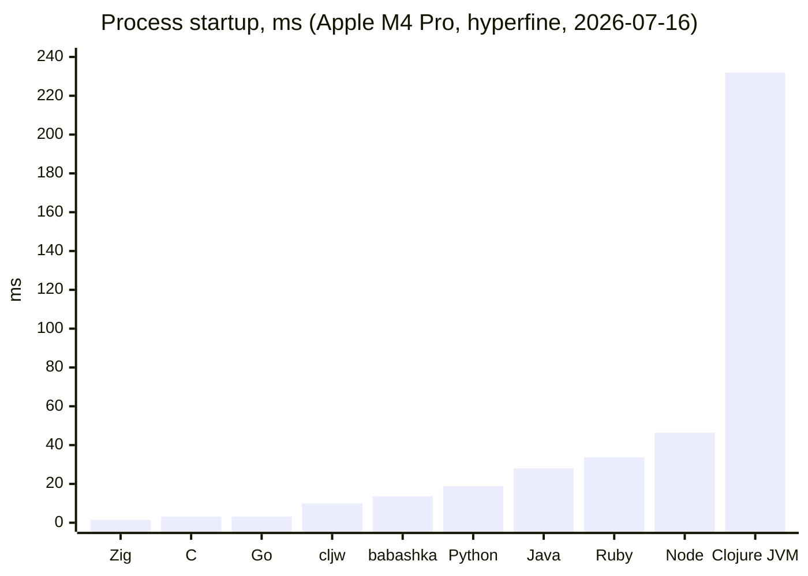

<p align="center">
  
</p>

<h1 align="center">ClojureWasm</h1>

<p align="center">
  <em>A JVM-free Clojure runtime in Zig. One 8.1 MB binary, a Wasm FFI, and a sandbox per module.</em>
</p>

<p align="center">
  <a href="https://github.com/BuddhiLW/ClojureWasm/releases/latest"></a>
  <a href="https://github.com/BuddhiLW/ClojureWasm/actions/workflows/ci.yml"></a>
  <a href="https://github.com/BuddhiLW/homebrew-tap"></a>
  <a href="https://ziglang.org/"></a>
  <a href="https://clojure.org/"></a>
  <a href="./LICENSE"></a>
</p>

ClojureWasm (`cljw`) runs Clojure without a JVM. It is written in Zig and
Clojure, ships as one static binary, starts in milliseconds, and embeds a
WebAssembly engine so a `.wasm` compiled from Rust, Go, C or Zig can be
required like a namespace and called like a function, inside a sandbox whose
fuel and memory the caller sets.

This is the maintained continuation of the project
[@chaploud](https://github.com/chaploud) started and released through v1.10.1.
The `1.x` line continues here; install and version pins point at this repo.
[Issues](https://github.com/BuddhiLW/ClojureWasm/issues) and PRs are open, and
the most useful report is Clojure code that behaves differently here than on
the JVM (there is an issue template for it).

## Where it shines

**Sandboxed plugins and tools.** A module instantiates with an empty import
object, so a guest reaches nothing the host did not grant, and every load takes
a budget. A tool that spins burns its fuel and returns an error; the host
process keeps running. That makes `cljw` a fit for hosts where untrusted code
runs in-process: plugin systems, MCP tool servers, request handlers that
evaluate user code.

```clojure
(def zk (wasm/load-component "zk_groth16.wasm" {:fuel 5000000 :max-memory-pages 64}))
(wasm/component-call zk "verify" proof 35)      ;=> [:ok true]
(wasm/component-call zk "spin")                 ; throws: exhausted its fuel budget
```

**Other languages' libraries, from Clojure.** JVM Clojure calls Java;
ClojureScript calls JavaScript; here the host is a language-neutral `.wasm`.
A WIT-typed component is a namespace: records arrive as maps, lists as
vectors, `result<T, E>` as `[:ok v]` / `[:err e]`.

```clojure
(ns my.app
  (:require ["typed_payload.wasm" :as tp]))   ; built from Rust, Go, C, Zig...

(tp/process {:xs [3 4 5] :label "data"})
;; => {:xs [3 4 5 12], :label "data!"}
(:arglists (meta #'tp/process))               ;; => ([input])
```

**Short-lived processes.** 8.1 MB on disk, about 6 ms from process start to
first eval, and `cljw build app.clj -o app` produces a self-contained
executable. CLI tools, serverless handlers, scripts that run a thousand times
a day.

**One program, two runtimes.** `cljw` reads `.cljc` under the feature set
`{:cljw :clj :default}`, and its sibling [clojurust](https://github.com/BuddhiLW/clojurust)
(`cljrs`, Rust-hosted, Cranelift JIT) reads `{:rust}`. A host-free `.cljc`
runs unchanged on the JVM, on `cljw` and on `cljrs`, and the same Rust crate
can serve both: as a zero-import Wasm component on `cljw`, as a native
`cdylib` on `cljrs`. The program picks confinement or speed without a rewrite.



Measured on that exact shape (a Groth16 prover over BN254, 2026-09-12, same
crate and feature set on both sides):

| | cljrs (native) | cljw (Wasm) |
|---|---|---|
| proof | 128 bytes | 128 bytes |
| verify, correct / wrong statement | true / false | true / false |
| wall time | 1.29 s (debug build) | 9.17 s |
| env vars visible to the prover | 212 | 0 |
| file read | granted | denied |
| wall clock | granted | trap |

Same proof bytes; the only thing that differs is how much authority the prover
holds while it runs.

## How it is put together



Both backends evaluate the same analyzer output, and the test suite runs every
case on both and fails on a mismatch. That differential oracle is how a
from-scratch runtime keeps Clojure semantics honest without a reference
implementation in the process. [`docs/architecture.md`](./docs/architecture.md)
has the map.

## Install

```sh
brew install buddhilw/tap/cljw        # macOS arm64, Linux x86_64
```

Binaries are also on the [Releases](https://github.com/BuddhiLW/ClojureWasm/releases)
page. The binary is not code-signed; if macOS blocks it once, clear the
quarantine flag: `xattr -d com.apple.quarantine "$(which cljw)"`.

From source (Zig 0.16; `direnv allow` or `nix develop` provides it):

```sh
zig build -Dwasm -Doptimize=ReleaseSafe   # → ./zig-out/bin/cljw
```

## Quickstart

```sh
cljw -e '(->> (range) (filter even?) (take 5))'                            # (0 2 4 6 8)
cljw -e '(wasm/call (wasm/load "docs/examples/wasm/add.wasm") "add" 40 2)'  # 42
cljw script.clj                    # run a file
cljw                               # REPL
cljw nrepl --port 7888             # nREPL, CIDER-compatible
cljw build script.clj -o app       # one self-contained native binary
```

## The Wasm FFI in one screen

```clojure
;; A core module: numbers in, numbers out, linear memory by hand.
(def m (wasm/load "kernel.wasm" {:fuel 1000000 :max-memory-pages 16 :engine :jit}))
(wasm/mem-write! m :f64 0 [1.0 2.0 3.0 4.0])
(wasm/call m "sum_f64" 0 4)                 ;=> 10.0
(wasm/mem-read m :f64 0 4)                  ;=> [1.0 2.0 3.0 4.0]

;; A WIT component: typed, so arguments and results are plain Clojure data.
(wasm/component-exports "greet.wasm")       ;=> ({:name "greet", ...})
(def c (wasm/load-component "greet.wasm" {:fuel 100000}))
(wasm/component-call c "greet" "zwasm")     ;=> "Hello, zwasm!"

;; A fault in the guest is a catchable Clojure exception, never a host crash.
(try (wasm/call (wasm/load "docs/examples/wasm/trap.wasm") "boom")
     (catch Exception e (ex-message e)))    ;=> "wasm/call: 'boom' ... trapped ..."
```

Budgets: a missing axis keeps the engine's finite default (1e9 fuel, 4096
pages), `0` removes a cap for a trusted guest, and fuel is per instance, so an
exhausted handle stays exhausted until you load again. The engine is JIT by
default for modules (`:engine :interp` to force the interpreter); components
run on the interpreter. Element types for memory access are the guest's
layout: `:i8 :u8 :i16 :u16 :i32 :u32 :i64 :f32 :f64`.

## Numbers

Every figure below is generated from a committed measurement file under
[`bench/`](./bench/README.md), not typed by hand, and the release size is
checked against the built binary by a gate on every push.





Persistent collections trade wins with JVM Clojure op by op (20 000 ops at
n = 16 000, Clojure 1.12.4): `assoc` on a map is 3.9× faster on cljw, `conj`
on a vector 4.4× slower; `seq` / `rest` / `next` over a vector are O(1) views
on both and cljw's are about 2× faster. The interpreter is where the JVM wins:
an empty loop iteration costs ~45 ns here against ~2 ns under the JVM JIT, so
tight numeric Clojure loops belong in a Wasm guest or on the JVM.
[Measured, both sides.](./docs/works/collection_performance.md)

Inside a Wasm guest the embedded engine runs 2× to 3× behind wasmtime on
compute-bound loops (fib: 1.29 s vs 0.49 s, same module, 2026-09-04) and one
`wasm/call` crossing costs about 1 µs. The FFI is for keeping a hot kernel
native, not for beating a standalone runtime;
[the comparison is published as measured](./bench/README.md).

## What runs

`clojure.core` and the everyday standard library: `string`, `set`, `walk`,
`zip`, `edn`, `data.json`, `data.csv`, `math`, `pprint`, `test`, `repl`,
`template`, `tools.cli`, `spec`. STM, atoms, agents, futures, promises,
watches, real threads. Lazy and chunked seqs, transducers, protocols, records,
multimethods, `deftype` / `reify`, the full numeric tower (`Ratio`, `BigInt`,
`BigDecimal`). A `deps.edn`-aware classpath with `:local/root` and `:git`
coordinates, and a CIDER-compatible nREPL.

Real libraries that load and run today (medley, tools.cli, data.json,
core.cache, malli, hiccup, honeysql, test.check, ...) are tracked in
[`docs/works/ladder.md`](./docs/works/ladder.md).

What does not: Maven artifacts are not fetched (`:mvn/version` is skipped,
clone and point a `:local/root` at it), `core.async` is not bundled, and JVM
interop that exists only to reach the JVM (`gen-class`, `proxy` over arbitrary
classes, reflection, `import` of arbitrary Java classes) is out of scope by
design. The full picture, including the intentional divergences, is
[`docs/clojure_vs_clojurewasm.md`](./docs/clojure_vs_clojurewasm.md).

## Documentation

[`docs/`](./docs/README.md) is the index. The pieces most people want:

- [`CHANGELOG.md`](./CHANGELOG.md), every release, newest first.
- [`docs/clojure_vs_clojurewasm.md`](./docs/clojure_vs_clojurewasm.md), what
  matches JVM Clojure, what deliberately does not, what is missing.
- [`docs/landscape.md`](./docs/landscape.md), where cljw sits among Clojure
  runtimes, `cljrs` included.
- [`docs/testing.md`](./docs/testing.md), the eight test layers and where a
  new test belongs. Read it before sending a patch.
- [`docs/works/demos.md`](./docs/works/demos.md), two real applications
  (a browser playground and a bookshelf with SQLite as `sqlite3.wasm`) whose
  source still builds.
- [`.dev/ROADMAP.md`](./.dev/ROADMAP.md), the plan.

## License and credit

Eclipse Public License 2.0, see [LICENSE](./LICENSE) and
[NOTICE](./legal/NOTICE).

ClojureWasm was created by [Shota Kudo (@chaploud)](https://github.com/chaploud),
who took it from nothing to a working JVM-free Clojure runtime with a Wasm FFI
through v1.10. Everything this fork ships is built on that work. The embedded
engine is [zwasm](https://github.com/zwasm/zwasm).
