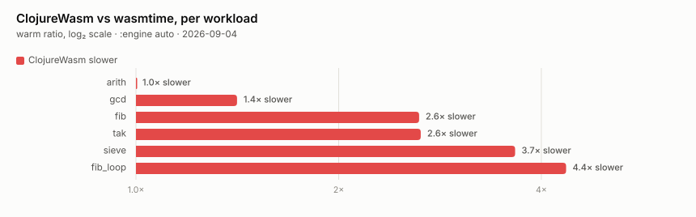

# Benchmarks

A workload catalogue + harness for measuring `cljw` against other runtimes.
Each `benchmarks/NN_<name>/` directory holds a `meta.yaml` (name / category /
`expected_output` / description) and one source file per language
(`bench.clj`, `bench.c`, `bench.zig`, `Bench.java`, `bench.py`, `bench.rb`,
`bench.js`, `bench.go`). `expected_output` doubles as a correctness oracle —
a runtime that prints the wrong value is shown as a SKIP, never timed.

> Every table and chart below is **generated** from a measurement YAML, never
> hand-maintained — a hand-curated table drifts from the data (the lesson from
> cw's predecessor). A run that is only printed to a terminal is scrollback,
> not data: it cannot be diffed against the next one, so each harness writes a
> `--yaml` datum first and the prose is rendered from it.

## How this directory is layered

Three strata, and nothing reaches across one:

| Stratum         | Files            | May do                                          |
|-----------------|------------------|-------------------------------------------------|
| **boundary**    | `bench/*.sh`     | spawn runtimes, read the clock, write the datum |
| **datum**       | `bench/*.yaml`   | nothing — inert, diffable, committed            |
| **calculation** | `bench/*.py`     | datum → Markdown, datum → SVG                   |

[`bench_domain.py`](./bench_domain.py) is the calculation stratum's model, and
the only place that knows what a runtime is called, which order the columns go
in, which workloads are cross-language-comparable, and that milliseconds are
not microseconds. The renderers depend on the model rather than on a YAML shape,
so [`gen_cross_table.py`](./gen_cross_table.py) (Markdown) and
[`gen_charts.py`](./gen_charts.py) (SVG) can never disagree about what was
measured, and a harness changing its output format touches one adapter.

A **Suite** — one machine, one toolchain, one date — is the unit of
comparability. Numbers from two Suites never share a table or a chart; a run on
a different box is a new Suite, not extra rows.

## Running

```sh
# cljw-only: per-bench millisecond table (builds ReleaseSafe, uses hyperfine)
bash bench/run_bench.sh                 # all native workloads
bash bench/run_bench.sh --bench=sieve   # one workload
bash bench/run_bench.sh --no-wasm       # skip the -Dwasm FFI workloads

# Cross-language comparison → measurement YAML
bash bench/compare_langs.sh --yaml=bench/cross-lang-latest.yaml

# Wasm FFI: cljw's embedded zwasm against wasmtime, same module, same loop count
bash bench/wasm_bench.sh --yaml=bench/wasm-ffi-latest.yaml
bash bench/wasm_bench.sh --engine=interp   # the fallback tier (default: auto)
bash bench/wasm_jit_vs_interp.sh           # one module, both tiers, ratio

# Render from a datum — either harness's, the shape is detected
yq -o=json bench/cross-lang-latest.yaml | python3 bench/gen_cross_table.py
yq -o=json bench/wasm-ffi-latest.yaml   | python3 bench/gen_charts.py --out docs/assets/bench

# Occasional-use tools (on demand)
bash bench/build_bench.sh               # `cljw build` artifact: build time / size / startup
clojure -M bench/clj_warm_bench.clj bench/benchmarks/01_fib_recursive/bench.clj
                                        # warm-JVM comparison for one workload
bash bench/release_metrics.sh           # binary-size + startup metrics (RELEASE_METRICS.md)
```

The cross-language harness compiles each language on the fly and auto-skips any
toolchain that is absent (`command -v` guard); run it from inside `nix develop`
for the pinned, reproducible toolchains. `cljw` is built `ReleaseSafe` (the
shipped build); timing is `hyperfine`, reported as cold-start wall-clock
(process launch → exit, startup included).

## Cross-language results

**Cold-start wall-clock** (process launch → exit), µs, lower is better. Columns:
ClojureWasm, then Python / Ruby / Node.js / Babashka, then Java / Go / C. Only
cold-start is published: it is the metric that compares uniformly across
languages. A startup-subtracted "compute" table is intentionally omitted —
for the fast languages the per-run compute sits below process-spawn noise
(~3 ms ± 10%), so subtracting startup would report noise, not signal.

<!-- BEGIN generated by gen_cross_table.py — do not edit by hand -->

**Conditions:** MacBook Pro (Mac16,8), Apple M4 Pro, 12-core (8P+4E), 48 GB RAM, macOS 26.5 (25F71), hyperfine **5 warmup + 10 runs**, 2026-06-24.

_Cold-start = process launch → exit (startup included). Only cold-start is shown: it is the metric that compares uniformly across languages. A startup-subtracted compute number is omitted because, for the fast languages, compute sits below process-spawn noise._

#### Cold-start wall-clock (µs, lower is better)

| Benchmark            | ClojureWasm | Python | Ruby  | Node.js | Babashka | Java  | Go   | C     |
|----------------------|-------------|--------|-------|---------|----------|-------|------|-------|
| fib_recursive        | 23503       | 25615  | 36206 | 48851   | 26225    | 24986 | 2555 | 2140  |
| fib_loop             | 3546        | 18711  | 34380 | 49948   | 13843    | 26226 | 3139 | 3228  |
| tak                  | 11434       | 19054  | 34719 | 47189   | 15794    | 26181 | 2849 | 3101  |
| arith_loop           | 38003       | 59859  | 55943 | 51623   | 51997    | 28567 | 4161 | 827   |
| map_filter_reduce    | 11702       | 18656  | 33838 | 48024   | 13248    | 25797 | 3484 | 1049  |
| vector_ops           | 6989        | 15602  | 32880 | 47261   | 12647    | 26178 | 5155 | 2374  |
| map_ops              | 4408        | 14300  | 32015 | 47221   | 12849    | 26636 | 5041 | 825   |
| list_build           | 4866        | 23680  | 31758 | 47516   | 11634    | 23584 | 4984 | 2959  |
| sieve                | 20054       | 18097  | 34168 | 50351   | 16635    | 29745 | 2434 | 264   |
| nqueens              | 20451       | 21384  | 39818 | 49237   | 23222    | 24990 | 3870 | 1629  |
| atom_swap            | 5324        | 16091  | 32937 | 48559   | 13307    | 26408 | 4283 | 1423  |
| gc_stress            | 22734       | 33736  | 42374 | 51323   | 33861    | 38145 | 9968 | 3341  |
| lazy_chain           | 8961        | 19591  | 33628 | 50266   | 14100    | 23685 | 2169 | 2203  |
| transduce            | 8849        | 18893  | 33743 | 50917   | 13956    | 28296 | 2544 | 13    |
| keyword_lookup       | 12776       | 22675  | 35916 | 48568   | 19623    | 29946 | 2021 | 1576  |
| protocol_dispatch    | 5898        | 17585  | 33875 | 48032   | —       | 28233 | 4878 | 1716  |
| nested_update        | 9847        | 16844  | 34572 | 51146   | 13978    | 27579 | 3986 | 1244  |
| string_ops           | 23163       | 31598  | 38890 | 50590   | 21241    | 32016 | 3667 | 3395  |
| multimethod_dispatch | 6056        | 17790  | 33182 | 49329   | 13020    | 27382 | 5585 | 2981  |
| real_workload        | 12541       | 19697  | 37310 | 49283   | 15693    | 32933 | 1166 | 1373  |
| gc_alloc_rate        | 38032       | —     | —    | 52104   | 35213    | —    | —   | —    |
| json_parse           | 35372       | 36176  | 46773 | 56555   | —       | —    | —   | —    |
| gc_large_heap        | 34647       | —     | —    | 54982   | 32237    | —    | —   | —    |
| bigint_factorial     | 21087       | 20824  | 45240 | 52074   | 16670    | 34572 | 4403 | —    |
| ratio_sum            | 28217       | —     | —    | —      | 37202    | —    | —   | —    |
| stm_refs             | 37714       | —     | —    | —      | 44392    | —    | —   | —    |
| regex_count          | 20801       | 24137  | 44836 | 50880   | 19061    | 35606 | 5833 | 16871 |
| sort                 | 7275        | 20719  | 34590 | 49259   | 13388    | 30158 | 6502 | 1900  |
| destructure          | 51360       | —     | —    | —      | 45291    | —    | —   | —    |
| edn_roundtrip        | 28368       | —     | —    | —      | 105447   | —    | —   | —    |

<!-- END generated -->

### About these numbers

- **A few ClojureWasm facts** (no comparison intended): cold-start folds in
  loading the embedded AOT-compiled `clojure.core` (ADR-0056), so the table is
  the real time-to-first-eval — for `cljw` (a tree-walking + bytecode-VM
  interpreter) that is mostly genuine work; for the compiled languages a
  small-workload run is mostly process spawn. `cljw` is built `ReleaseSafe`
  (optimised, all safety checks on).
- **Reproducibility.** Toolchains are pinned in `flake.nix`; run from inside
  `nix develop` for the full, reproducible column set. The harness auto-skips a
  language whose toolchain is absent.

## Wasm FFI — cljw's embedded zwasm against wasmtime

This is the measurement behind the north star (gap II, Wasm-edge-native): when
a Clojure program reaches through `wasm/call` into a module, what does that
execution cost against a dedicated wasm runtime?

Both sides run the **same TinyGo-compiled `.wasm` export with the same
in-module loop count**, so the iteration happens inside wasm on both sides and
neither host's own interpreter is in the loop. That makes it wasm-execution
against wasm-execution rather than language against language.

`(wasm/load path opts)` defaults to zwasm's `.auto` engine — JIT-first with
interpreter fallback (D-488) — so the default column is JIT against JIT.
`--engine=interp` measures the fallback tier instead.

<!-- BEGIN generated by gen_charts.py — do not edit by hand -->



<!-- END generated -->

<!-- BEGIN generated by gen_cross_table.py — do not edit by hand -->

**Conditions:** Linux 7.0.0-30-generic x86_64, Intel(R) Core(TM) Ultra 9 185H, ClojureWasm v1.14.0 (ReleaseSafe, wasm), wasmtime 48.0.0 (f1412a598 2026-08-20), :engine auto, hyperfine **2 warmup + 5 runs**, 2026-09-04.

_Both runtimes execute the SAME `.wasm` export with the same in-module loop count, so this is wasm-execution against wasm-execution, not language against language. `warm` subtracts each runtime's own module-load + startup; at the sub-10 ms end that subtraction is larger than the signal, so read only the workloads that run for hundreds of ms._

#### Total wall-clock — module load + execution (ms, lower is better)

| Benchmark | ClojureWasm | wasmtime |
|-----------|-------------|----------|
| fib       | 1333.6      | 501.5    |
| tak       | 4301.0      | 1619.4   |
| arith     | 46.3        | 10.7     |
| sieve     | 95.1        | 26.1     |
| fib_loop  | 69.4        | 18.1     |
| gcd       | 185.4       | 110.8    |

#### Execution — load and startup subtracted (ms, lower is better)

| Benchmark | ClojureWasm | wasmtime |
|-----------|-------------|----------|
| fib       | 1286.4      | 488.5    |
| tak       | 4253.8      | 1606.4   |
| arith     | 0.1         | 0.1      |
| sieve     | 47.9        | 13.1     |
| fib_loop  | 22.2        | 5.1      |
| gcd       | 138.2       | 97.8     |

#### Startup — process spawn + runtime init (ms, lower is better)

| Startup (ms)         | ClojureWasm | wasmtime |
|----------------------|-------------|----------|
| process spawn + init | 47.2        | 13.0     |

_Warm = cold − startup; digits below startup-measurement noise are indicative._

<!-- END generated -->

### Reading the FFI numbers

- **The gap is 1.4-4.4×, not an order of magnitude.** wasmtime is a dedicated,
  mature wasm JIT; zwasm is a from-scratch engine embedded in a Clojure runtime
  whose binary is ~9 MB in total. Landing within a small constant of wasmtime on
  compute-bound modules is the result that matters for gap II — it says a
  program can reach into wasm from Clojure without paying an execution tax that
  changes what is feasible.
- **`arith` is below the floor and carries no signal.** Its total (46.3 ms) is
  under cljw's own startup (47.2 ms), so the subtraction clamps to 0.1 and the
  "1.0×" is arithmetic, not a measurement. The chart shows it for completeness;
  read `fib`, `tak`, `sieve`, `fib_loop` and `gcd`.
- **The engine tier is worth an order of magnitude, and it is on by default.**
  `bench/wasm_jit_vs_interp.sh` runs one 20M-iteration `i32` loop through both
  tiers of the same embedding: **0.157 s on `:jit` against 2.430 s on
  `:interp` — 15.5×**, end-to-end including startup, on this box. That ratio is
  why the `.interp` → `.auto` default flip (D-488) was the load-bearing change
  and not a tuning knob.
- **Startup is cljw's, not wasm's.** The 47 ms cljw pays before the first
  `wasm/call` is a Clojure runtime booting its embedded AOT `clojure.core`
  (ADR-0056), against wasmtime's 13 ms of loading only the module. A long-lived
  process pays it once; the `warm` table is the honest per-call view.
