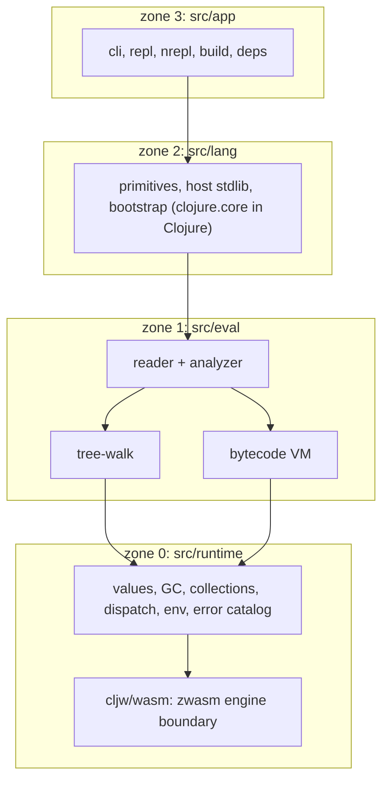

# ClojureWasm architecture

A short orientation for contributors. `.dev/ROADMAP.md` is the plan; this
file is the map of what is built.

## What it is

ClojureWasm (`cljw`) is a Clojure runtime written in Zig 0.16 and Clojure. It
does not target the JVM: Clojure semantics are implemented directly, with a
tree-walking interpreter and a bytecode VM as two backends over one analyzer,
and an embedded WebAssembly engine (zwasm) that turns `.wasm` modules and WIT
components into callable namespaces.

The charter is behavioural equivalence with JVM Clojure on the user-observable
surface (`.dev/project_facts.md`, F-011), single-binary distribution, and
batch / REPL / nREPL / `build` entry points.



## Four zones

Source is divided into four zones with a downward-only dependency rule
(`scripts/zone_check.sh --gate` enforces it against an in-script baseline):

| Zone | Path | Responsibility |
|---|---|---|
| 0 | `src/runtime/` | Value, GC, collections, dispatch, env, error catalog, the Wasm boundary |
| 1 | `src/eval/` | reader, analyzer, backends (`backend/{tree_walk,vm}`), bytecode |
| 2 | `src/lang/` | primitives, host stdlib equivalents, bootstrap; `src/lang/clj/` is the Clojure half of the runtime |
| 3 | `src/app/`, `src/main.zig` | CLI, REPL, nREPL, `build`, `deps.edn` |

Lower zones never import upper ones; cross-zone calls go through vtables
installed at startup (`Runtime.vtable`). A second rule keeps the host-surface
trees apart: `runtime/cljw/**` (cljw-native surface) and `runtime/java/**`
(the JVM-shaped emulation surface) do not import each other.

About two thirds of `clojure.core` is written in Clojure under
`src/lang/clj/clojure/` and bootstrapped by cljw itself; the AOT-compiled
bootstrap is embedded in the binary, which is why startup does not pay for
reading it.

## Values and memory

Every value is one 8-byte NaN-boxed word; heap objects carry a header and are
collected by a mark-sweep GC over three allocators with distinct lifetimes.
A String is raw bytes, decoded as UTF-8 with the JDK's replacement rule where
a code point is needed, so `count` means code points and any byte sequence a
file or a Wasm guest hands back is a legal String.

## Dual backend

TreeWalk and the VM evaluate the same analyzer output. `Evaluator.compare`
(`--compare` on the CLI) runs both and fails on a mismatch, and the build's
differential oracle runs the unit and diff suites twice (the VM build plus a
`-Dbackend=tree_walk` build), so every case is checked on both backends. The
VM has a flattened call-frame stack and fused superinstructions; all of it is
VM-internal and still verified bit for bit against TreeWalk.

## Error system

`src/runtime/error/catalog.zig` holds every user-facing message. Modules raise
through `error_catalog.raise(.code, loc, args)`; no other file formats an
error string. Three layers: user input (a catalog Code, catchable), a runtime
invariant violation (`internal_error`), and a native crash (top-level catch
plus signal handler). `@panic` on a user-reachable path is forbidden.

## Tiers

Clojure compatibility is graded in `data/compat_tiers.yaml`, read by the gate:

- **Tier A**: full semantic match, upstream test suite passes.
- **Tier B**: same names, same behaviour, cljw-native implementation.
- **Tier C**: best effort with documented gaps.
- **Tier D**: permanently excluded (`gen-class`, `gen-interface`, `compile`,
  deep `proxy`, deep `bean`, `java.awt.*`, `javax.swing.*`, deep
  `java.lang.reflect.*`). Each raises its own catalog error naming the
  cljw-native alternative.

Intentional divergences from JVM Clojure are ledgered in
`.dev/accepted_divergences.yaml` (`AD-NNN`), each pinned by a regression test,
and read as prose in [`clojure_vs_clojurewasm.md`](./clojure_vs_clojurewasm.md).

## The Wasm boundary

`src/runtime/cljw/wasm/` wraps zwasm. Two surfaces:

- **Core modules**: `wasm/load` (fuel, memory pages, engine selection),
  `wasm/call`, `wasm/mem-read` / `wasm/mem-write!` / `wasm/mem-size`, and
  `wasm/run` for a WASI command with stdout captured under a byte cap.
- **Components**: `wasm/load-component` (fuel, memory pages),
  `wasm/component-call`, `wasm/component-exports`, resource handles with
  deterministic `wasm/resource-drop`, and `cljw.wasm/require-component`,
  which `(:require ["c.wasm" :as c])` expands to: every export is interned as
  a Var whose arglists come from the WIT signature, and a re-require retires
  the Vars the new build no longer exports.

Both surfaces are bounded by default (zwasm's finite fuel and memory) and
report a budget kill as a fuel error, distinct from a guest trap. A module
instantiates with an empty import object; WASI preopens are the only way a
guest reaches the filesystem. Modules run on the JIT by default, components on
the interpreter.

## Current state

Shipped through the tag the release badge points at; `CHANGELOG.md` is the
record. Releases are cut by the release workflow on a push to `main` and ship
as single binaries for macOS arm64 and Linux x86_64 plus the Homebrew tap
(`brew install buddhilw/tap/cljw`).

Built and exercised end to end: the reader, analyzer, both backends, the
error system, persistent collections and the GC; the numeric tower (`Long`
with `BigInt` promotion, `Ratio`, `BigDecimal`); lazy and chunked sequences,
transducers, protocols, records, multimethods, `deftype` / `reify`; STM,
atoms, agents, futures, promises, delays, watches, `locking`, real threads;
namespaces, a `deps.edn`-aware classpath (`:local/root` and `:git`
coordinates; Maven is not fetched), a full base-protocol nREPL (CIDER works),
and about two dozen bundled `clojure.*` namespaces.

Performance work is ledgered in `.dev/optimizations.md` (`O-NNN` rows,
`PERF:` markers at each site); measurements live under `bench/` and are not a
gate step. Known-broken and deferred work is `.dev/debt.yaml`, one testable
barrier per row.

## Where to look

| Question | Where |
|---|---|
| What is the plan? | `.dev/ROADMAP.md` |
| Which invariants are law? | `.dev/project_facts.md` (`F-NNN`) |
| Why was a decision made? | Commit messages cite `ADR-NNNN`; the ADR record is kept in the maintainer's knowledge base, not in the tree |
| What debt is tracked? | `.dev/debt.yaml` |
| What namespace is at what tier? | `data/compat_tiers.yaml` |
| Which divergences are intentional? | `.dev/accepted_divergences.yaml` |
| What testing layer is what? | [`testing.md`](./testing.md), `test/README.md` |
| What does a gate check? | The header of its script under `scripts/` |

## Build and test

```sh
zig build -Dwasm -Doptimize=ReleaseSafe   # the shipped, Wasm-enabled binary
bash test/run_all.sh --smoke <e2e-step>   # per-commit smoke
bash scripts/run_gate.sh                  # the full gate, run alone
zig fmt src/
```

`zig build test` is always run with `-Dwasm`; a behaviour probe always uses
the ReleaseSafe binary, never Debug. CI runs the same gate script on macOS
arm64 and Linux x86_64 for every pull request and every push to `main`.
